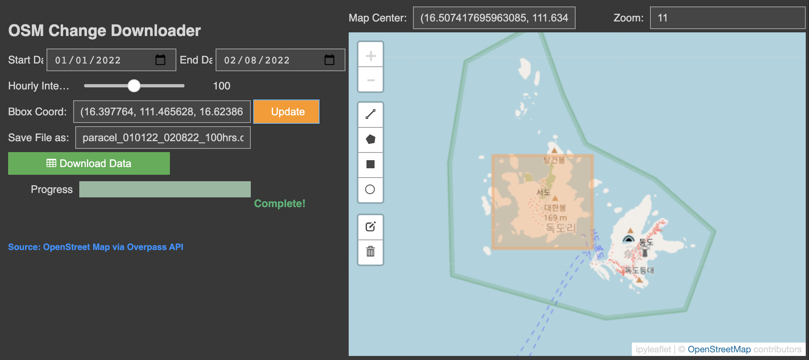
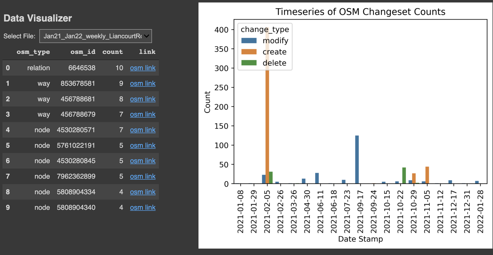

# Interactive Applications via ipywidget for Downloading Historical Meteorological Data from RAWS</u>

## Table of Contents  
- [Project Details](#project-details)   
- [Primary Packages & Tools](#primary-packages) 
- [Data Sources](#data-sources)   
- [Walk-Through](#walk-through)  
    1. [Interactive Mapping & Selection](#(1)-interactive-mapping-&-selection)  
    2. [Visualizing Weather Data](#(2)-visualizing-weather-data)   
___

## Project Details

The main objective of this exercise is to create an alternative way to interactively download osm data that highlights edits taken place between a specified time interval located within a region of interest (ROI). The ROI is determined by a user defined bounding box via the draw control tool available in the ipyleaflet package. The retrieval of the osm differenced data, using adiff from the Overpass API, is done in hourly intervals, also specific by the user. In this way we can visualize the change count for a particular day and for a particular osm feature. Lastly, the retrieved data will be visualized in a dashboard to best illustrate the changes based on temporal and spatial components. 

The dashboard will mainly include the timeseries, quantifying the total count of features created, deleted, and modified within a set time interval. A table will highlight osm features with the most changes and edits done. Greater the changes within the a smaller time-frame, the higher chance this feature is important and/or should be flagged. The dashboard will also show any geometric changes and/or modifications to key-value pairs i.e. tags. 

## Primary Packages

- ipyleaflet 
- ipywidget
- requests, urllib3, re, beautifulsoup, json
- numpy, panda, geopandas, shapely
- jupyter notebook (ipynb) for displaying custom GUI 

## Data Sources

OpenStreetMap 
- https://www.openstreetmap.org

## Walk-Through

## (1) Interactive Mapping & Data Download

The initial tab allows for the user to specify a region on the ipyleaflet map using the Draw Control widgets to select OSM features in the AOI. The user can also select a start/end date range, hourly interval, and filename. 

  

## (2) OSM Data Dashboard

The final tab is the dashboard highlighting important features, change activity, and changes to geometry/tags through the use of tables, timeseries plots, and interactive maps.  

