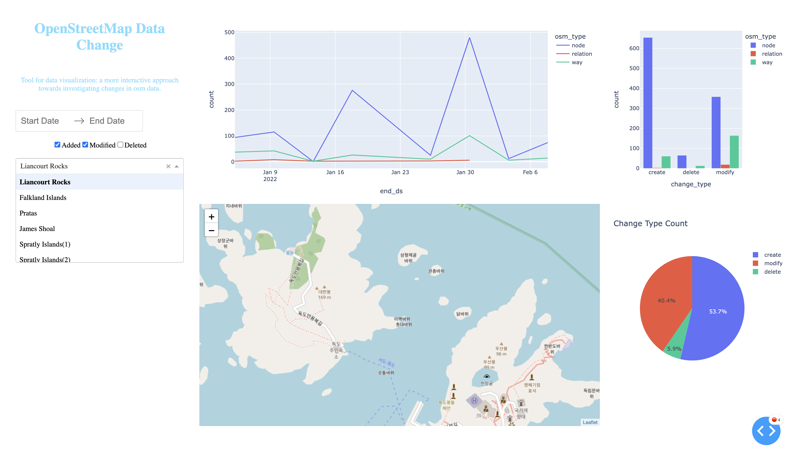

# Interactive Dashboard for Visualizing OSM Data Change</u>

## Table of Contents  
- [Project Details](#project-details)   
- [Primary Packages & Tools](#primary-packages) 
- [Data Sources](#data-sources)   
- [Walk-Through](#walk-through)  
    1. [Interactive Mapping & Selection](#(1)-interactive-data-queryg)  
    2. [OSM Data Dashboard](#(2)-osm-data-dashboard)   
    3. [OSM Geometry Edit](#(3)-osm-geometry-edit)   
    4. [Alternative with DASH](#(4)-alternative-with-dash)   
___

## Project Details

The main objective of this exercise is to investigate and iteratively refine methods of creating a tool that is useful for navigating osm data changes. This will have an interactive component where users will be able to pre-define and specify a region of interest (ROI), time range, and time interval which will all then be used to query osm data changes via the Overpass API. 

Various interesting tools and packages will be used including ipyleaflet and ipywidget to enable an intuitive and comprehensive user experience. For example, the user defined ROI will be a bounding box created via the draw control tool available in the ipyleaflet package. The retrieval of the osm differenced data, using adiff from the Overpass API, is done at unique time interval (e.g. 12, 24, 72 hours), also specified by the user. In this way we can visualize the change count for a particular day and for a particular osm feature. Lastly, the retrieved data will be visualized in a dashboard to best illustrate the changes based on temporal and spatial components. 

The dashboard will mainly include a timeseries, quantifying the total count of features created, deleted, and modified within a set time interval. A table will highlight osm features with the most changes and edits done. This is based on the assumption: greater the changes within the a smaller time-frame, the higher chance this feature is important and/or should be flagged. The dashboard will also show any geometric changes and/or modifications to key-value pairs i.e. tags based on individual osm id + types. 

## Primary Packages

- ipyleaflet 
- ipywidget
- requests, urllib3, xml.etree.ElementTree
- numpy, panda, geopandas, shapely
- plotly, dtale, matplotlib, seaborn 
- jupyter notebook (ipynb) for displaying custom GUI 

## Data Sources

OpenStreetMap 
- https://www.openstreetmap.org

## Walk-Through

## (1) Interactive Data Query

The initial tab allows for the user to specify a region on the ipyleaflet map using the Draw Control widgets to select OSM features in the AOI. The user can also select a start/end date range, hourly interval, and filename. 

  

## (2) OSM Data Dashboard

This section will highlight the frequency of changes in OSM based on the collected timestamp.   

## (3) OSM Geometry Edit

This interactive map will highlight the bounding boxes of geometry edits within the queried region. 

  

## (4) Alternate Dashboard with DASH 

Tools just for the use in an ipython notebook environment is not ideal so an alternative method is to create the dashboard straight into Dash. This way, we can 
deploy in a web environment instead. 

